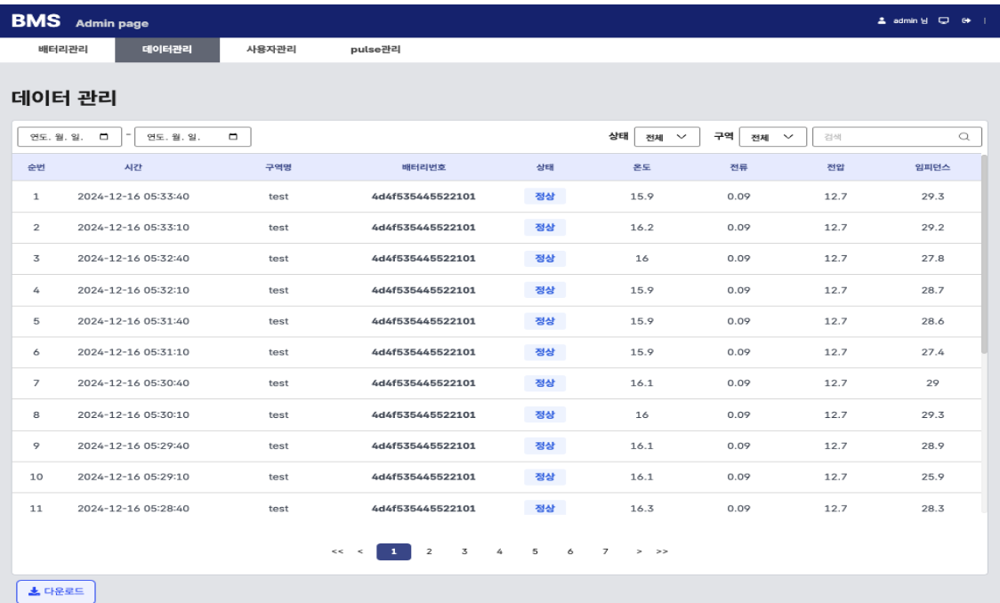

## LoRaWAN 기반 배터리 관리 시스템

## 💻 프로젝트 소개
배터리 셀 모듈의 상태를 모니터링하고 관리하는 시스템

  
### 📌 주요 기능
- 실시간 배터리 상태 모니터링
- 이상 상황 감지
- 데이터 로깅

## ⌛️ 개발 기간
2024.04 ~ 2024.12

### 🔧 개발 환경
### 사용 언어 및 프레임워크

 

 

---

### 인프라 및 배포 환경
  

   

## 2. 주요 기능

| 로그인 / 회원 관리 | 대시보드 | 배터리 관리 | 배터리 로깅 | 펄스 관리 |
|-----------------|----------|-----------|------------|-------------|
|  |  |  |  |  |
| 사용자 인증, 가입, 권한 관리 | 실시간 데이터 시각화 | 통계 및 보고서 제공 | 환경 설정, 테마 변경 | 알림 및 메시지 관리 |

> ⚠️ 현재는 서비스 배포가 중단된 상태이므로, 예시 이미지를 사용했습니다.
  
## 📧 연락처 정보
alswn9691@naver.com  

  
본 프로젝트는 ~~ 프로젝트입니다.
